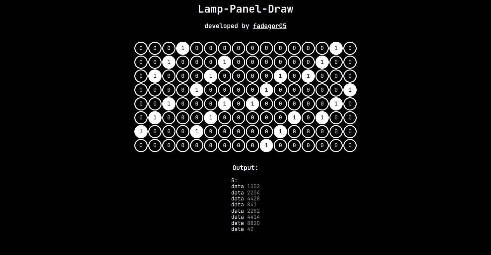

# Lamp-Panel-Draw

This is a simple project based on <b>HTML</b>, <b>CSS</b> and <b>JS</b>. It can help you in drawing something using <a href="https://kpolyakov.spb.ru/prog/lamp.htm">Lampanel</a>. It generates <b>HEX</b> numbers represented as data in <b>Assembler</b> that used in <b>Lampanel</b>.

You can try this project <a href="https://htmlpreview.github.io/?https://github.com/fadegor05/Lamp-Panel-Draw/blob/main/index.html">here</a>.

### Dependencies

- <a href="https://necolas.github.io/normalize.css/8.0.1/normalize.css">Normalize.css</a>